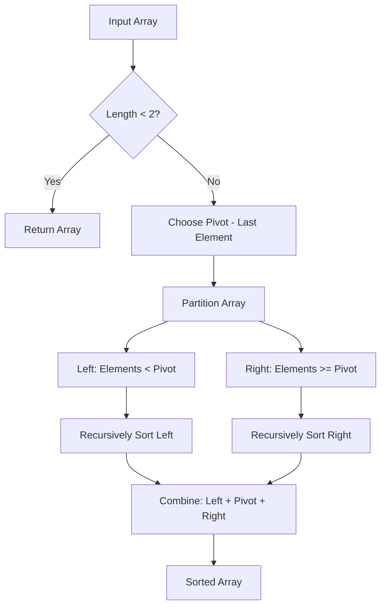

# 🚀 Quick Sort Algorithm

[](https://developer.mozilla.org/en-US/docs/Web/JavaScript)
[](https://en.wikipedia.org/wiki/Quicksort)
[-green?style=for-the-badge)](https://github.com)

> A clean and efficient implementation of the Quick Sort algorithm in JavaScript using the divide-and-conquer approach.

## 📖 Overview

Quick Sort is one of the most efficient sorting algorithms that uses a **divide-and-conquer** strategy. It works by selecting a 'pivot' element and partitioning the array around the pivot, then recursively sorting the sub-arrays.

## 🔍 How It Works



### 🎯 Algorithm Steps

1. **🛑 Base Case**: If array has less than 2 elements, return it (already sorted)
2. **📍 Choose Pivot**: Select the last element as pivot
3. **🔄 Partition**: Divide array into two parts:
   - `left`: elements smaller than pivot
   - `right`: elements greater than or equal to pivot
4. **🔁 Recurse**: Apply quickSort recursively on both parts
5. **🔗 Combine**: Merge results: `[...quickSort(left), pivot, ...quickSort(right)]`

## 💻 Implementation

```javascript
function quickSort (unsortedArr) {
    console.log(unsortedArr.length < 2)
    if (unsortedArr.length < 2) return unsortedArr;
    
    let pivot = unsortedArr[unsortedArr.length - 1];
    const left = [];
    const right = [];
    
    for ( let i = 0 ; i < unsortedArr.length - 1 ; i++ ) {
        if (unsortedArr[i] < pivot) {
            left.push(unsortedArr[i]);
        } else {
            right.push(unsortedArr[i]);
        }
    }
    
    return [...quickSort(left), pivot, ...quickSort(right)]
}

// Example usage
console.log(quickSort([1,9,10,22,5,8,2,11]));
```

## 🎮 Usage Example

```javascript
// 📥 Input
const unsortedArray = [1, 9, 10, 22, 5, 8, 2, 11];

// 🎯 Process
const sortedArray = quickSort(unsortedArray);

// 📤 Output
console.log(sortedArray); 
// Result: [1, 2, 5, 8, 9, 10, 11, 22]
```

### 📊 Visual Example

```
Initial Array: [1, 9, 10, 22, 5, 8, 2, 11]
                                      ↑
                                   pivot=11

Partition:
Left  (< 11): [1, 9, 10, 5, 8, 2]
Right (≥ 11): [22]

After sorting:
Left sorted:  [1, 2, 5, 8, 9, 10]
Right sorted: [22]

Final Result: [1, 2, 5, 8, 9, 10] + [11] + [22]
            = [1, 2, 5, 8, 9, 10, 11, 22]
```

## ⚡ Complexity Analysis

| Case | Time Complexity | Description |
|------|----------------|-------------|
| **🟢 Best** | `O(n log n)` | Pivot divides array into equal halves |
| **🟡 Average** | `O(n log n)` | Random pivot selection |
| **🔴 Worst** | `O(n²)` | Pivot is always smallest/largest element |

| **Space Complexity** | `O(log n)` |
|----------------------|------------|
| **Auxiliary Space** | `O(n)` for creating left/right arrays |

## ✅ Advantages

- 🚀 **Fast**: Efficient for large datasets
- 🎯 **In-place**: Can be modified to sort in-place
- 🏗️ **Divide & Conquer**: Elegant recursive approach
- 📊 **Cache Efficient**: Good locality of reference

## ❌ Disadvantages

- 🐌 **Worst Case**: O(n²) performance in worst case
- ⚖️ **Not Stable**: Order of equal elements may change
- 📚 **Stack Space**: Requires recursion stack space
- 🎲 **Pivot Dependent**: Performance depends on pivot selection

## 🚀 Getting Started

### Prerequisites
- Node.js (for running outside browser)
- Modern JavaScript environment

### Installation & Running

1. **Clone or download** the code
2. **Save** as `quicksort.js`
3. **Run** with Node.js:
   ```bash
   node quicksort.js
   ```
4. **Or run** in browser console

### 🧪 Testing

```javascript
// Test with different arrays
console.log(quickSort([64, 34, 25, 12, 22, 11, 90]));
console.log(quickSort([5, 2, 8, 1, 9]));
console.log(quickSort([1])); // Edge case: single element
console.log(quickSort([]));  // Edge case: empty array
```

## 📝 Notes

- 🎯 Uses **last element** as pivot
- 🔍 Includes debug `console.log` for base case tracking
- ⬆️ Sorts in **ascending order** (smallest to largest)
- 🔄 **Recursive implementation** with ES6 spread operator


---

<div align="center">

**⭐ Star this repository if you found it helpful!**


Made with ❤️ by Syihab and JavaScript

</div>